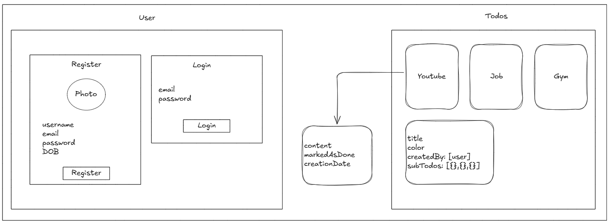

# Introduction: What is Data Modeling?

Here you won’t learn how to connect to a database, but rather how to create the model schemas that define your data's structure.

Imagine you're building a house. Before you lay a single brick, you need a **blueprint**. The blueprint defines the structure: where the rooms go, how many bathrooms there are, and what materials to use.

**Data Modeling is the blueprint for your database.**

-   **MongoDB:** This is your plot of land. It's a flexible database where you can store data.
-   **Mongoose:** This is your architect. It's a tool that helps you create strict blueprints (called **Schemas**) for your MongoDB database, making your data predictable, organized, and easier to work with in your application.

We will create three interconnected blueprints for a simple To-Do application: one for **Users**, one for their main **Todos**, and one for the **Sub-Todos** within each main todo.

---

## Visualizing The Model Architecture

Here is how all our models connect. The arrows represent the `ref` property, linking one document to another via its `ObjectId`.

-   A **User** can have many **Todos**.
-   A **Todo** is created by one **User**.
-   A **Todo** can have many **SubTodos**.
-   A **SubTodo** is also created by one **User**.



This structure is a robust and scalable way to model data for a real-world application using Mongoose.

---

## Part 1: Project Structure

A clean folder structure is crucial for any project. For our Mongoose models, we'll follow a standard convention. Inside your main backend folder, create a new folder called `models`.

```
MyProject/
└── backend/
    ├── node_modules/
    ├── models/
    │   ├── user.models.js
    │   ├── todo.models.js
    │   └── sub_todo.models.js
    ├── package.json
    └── server.js
```

**Why the `.models.js` naming?**
This is simply a professional naming convention. It doesn't change how the code works, but it immediately tells any developer looking at your project that this file defines a database model.

---

## Part 2: The User Model (The Foundation)

Let's start with the most fundamental part of our app: the user. We need to define what information every user will have.

File: `models/user.models.js`

```javascript
import mongoose from "mongoose";

// A Schema is the blueprint that defines the structure of our documents.
const userSchema = new mongoose.Schema(
    // 1. The first object defines the fields and their rules.
    {
        username: {
            type: String, // The data type must be a string.
            required: true, // This field cannot be empty.
            unique: true, // Each user must have a unique username.
            trim: true, // Removes extra spaces from the start and end.
        },
        email: {
            type: String,
            required: true,
            unique: true,
            trim: true,
            lowercase: true, // Converts the email to all lowercase letters.
        },
        password: {
            type: String,
            required: [true, "Password is required"], // 'required' with a custom error message.
        },
    },
    // 2. The second object defines schema options.
    {
        timestamps: true, // Automatically adds `createdAt` and `updatedAt` fields.
    }
);

// Mongoose compiles the schema into a Model. A model is a class with which we construct documents.
export const User = mongoose.model("User", userSchema);
```

### Explanation

#### **What is a `Schema`?**

A `mongoose.Schema` is an object that defines the structure for any **document** (a single record, like one user) that will be stored in a **collection** (a group of similar documents, like all users).

1.  **Field Definitions (`{...}`)**: This first object is the core of your blueprint.

    -   **`type: String`**: Tells Mongoose this field should store text. Other types include `Number`, `Boolean`, `Date`, etc.
    -   **`required: true`**: A validation rule. If you try to save a new user without a username, Mongoose will throw an error.
    -   **`unique: true`**: This is an index. It tells MongoDB to ensure no two documents in this collection have the same value for this field. It's crucial for things like usernames and emails.
    -   **`trim: true`**: A "modifier." If a user accidentally types `" aditya "`, Mongoose will clean it up and save it as `"aditya"`.
    -   **`lowercase: true`**: Another modifier. It ensures emails like `"Test@Example.COM"` are saved as `"test@example.com"`, which prevents duplicate accounts.

2.  **Schema Options (`{ timestamps: true }`)**:

    -   This is a magical option. When you enable it, Mongoose automatically adds two fields to your document:
        -   `createdAt`: A timestamp for when the document was first created.
        -   `updatedAt`: A timestamp that is updated every time you modify the document.
    -   This is incredibly useful for tracking data history without writing any extra code.

#### **What is a `Model`?**

The line `mongoose.model("User", userSchema)` is where the magic happens. It takes your blueprint (`userSchema`) and creates a powerful tool (`Model`) that you can use to interact with the database.

-   `"User"`: This is the name of your model.
-   **How the Collection is Named**: Mongoose automatically takes your model name ("**User**"), makes it **lowercase**, and **pluralizes** it to create the database collection name. So, your `User` model will save data to the `users` collection in MongoDB.

Finally, `export const User` makes your newly created `User` model available to be used in other files in your project.

---

## Part 3: The Todo Model (Creating Relationships)

Now, let's define the blueprint for a single "To-Do" item. A key feature here is that every todo must belong to a user. This is our first **data relationship**.

File: `models/todo.models.js`

```javascript
import mongoose from "mongoose";

const todoSchema = new mongoose.Schema(
    {
        content: {
            type: String,
            required: true,
        },
        complete: {
            type: Boolean,
            default: false, // If not specified, a new todo will be marked as incomplete.
        },
        // This is the reference to the User model!
        createdBy: {
            type: mongoose.Schema.Types.ObjectId,
            ref: "User", // The name of the model we are referencing.
            required: true,
        },
        // An array to hold references to all sub-todos
        subTodos: [
            {
                type: mongoose.Schema.Types.ObjectId,
                ref: "SubTodo", // Reference to the SubTodo model.
            },
        ],
    },
    { timestamps: true }
);

export const Todo = mongoose.model("Todo", todoSchema); // Collection will be named "todos"
```

### Explanation

#### **The Concept of Relationships**

Databases are powerful because they let you link different pieces of data together. The `createdBy` field is the perfect example. Instead of storing the user's entire information (username, email, etc.) inside every todo, we just store a **unique reference** to that user.

-   **`type: mongoose.Schema.Types.ObjectId`**: This is a special data type in MongoDB. Think of it as a unique ID number that every single document in your entire database gets automatically (its `_id`). We are telling Mongoose that the `createdBy` field will store one of these unique IDs.
-   **`ref: "User"`**: This is the most important part. The `ref` (short for reference) property tells Mongoose, "The ID stored in this field belongs to a document in the collection associated with the `User` model."

This creates a powerful link. Later, you can fetch a todo and easily "populate" its `createdBy` field to get all the information about the user who created it.

#### **One-to-Many Relationship: `subTodos`**

The `subTodos` field is an **array** `[]`. This signifies a "one-to-many" relationship. One `Todo` document can be linked to _many_ `SubTodo` documents. Inside the array, we specify that each element must be an `ObjectId` that references a document from the `SubTodo` model (which we'll create next).

---

## Part 4: The Sub-Todo Model (Nested Data)

Finally, let's define the blueprint for the smaller tasks within a main todo.

File: `models/sub_todo.models.js`

```javascript
import mongoose from "mongoose";

const subTodoSchema = new mongoose.Schema(
    {
        content: {
            type: String,
            required: true,
        },
        complete: {
            type: Boolean,
            default: false,
        },
        // Each sub-todo also knows which user created it.
        createdBy: {
            type: mongoose.Schema.Types.ObjectId,
            ref: "User",
            required: true,
        },
    },
    { timestamps: true }
);

export const SubTodo = mongoose.model("SubTodo", subTodoSchema); // Collection will be "subtodos"
```

This model is very similar to the others. It has its own content and completion status and, importantly, also references the `User` who created it. This ensures data integrity—you always know who owns every single piece of data in your application.

---

## QnA

Here are the answers to your questions about Mongoose.

### Why Mongoose?

Mongoose is used with MongoDB to give your data a predictable structure. MongoDB is very flexible (schemaless), which is great, but can lead to inconsistent data. **Mongoose enforces a strict structure (a schema)** so that every piece of data you save looks the same. This makes your code safer, more predictable, and easier to manage.

---

### What is a Schema?

A **Schema** is a **blueprint** for your data. It defines what fields a document will have, what type of data each field will hold (e.g., String, Number, Boolean), and what rules that data must follow (e.g., is it required? must it be unique?).

Think of it like a fill-in-the-blanks form:

-   **Name**: \_\_\_\_\_\_ (Must be text)
-   **Age**: \_\_\_\_\_\_ (Must be a number)
-   **Email**: \_\_\_\_\_\_ (Must be text and is required)

---

### What is a Model?

A **Model** is the tool you use to actually work with your data based on the schema. After you define your schema (the blueprint), you compile it into a model. The model is what lets you **create, read, update, and delete** documents in your database collection. It's the bridge between your application's code and the database.

-   **Schema** = The blueprint.
-   **Model** = The factory that uses the blueprint to build and manage the houses (your data).

---

### Snippet to Create a Schema

Here is a basic example of creating a schema and a model for a user.

```javascript
import mongoose from "mongoose";

// 1. Define the Schema (the blueprint)
const userSchema = new mongoose.Schema({
    username: {
        type: String,
        required: true,
        unique: true,
    },
    email: {
        type: String,
        required: true,
    },
    age: {
        type: Number,
        default: 18, // A default value if none is provided
    },
});

// 2. Compile the Schema into a Model (the factory)
const User = mongoose.model("User", userSchema);
```

---

### What does `mongoose.Schema.Types.ObjectId`, `ref:"User"` mean?

This line creates a **relationship** between two different collections. Let's break it down:

-   **`mongoose.Schema.Types.ObjectId`**: This specifies the data type. An **ObjectId** is MongoDB's unique ID for every document. Think of it as a unique serial number or a primary key. This field will store the unique ID of another document.
-   **`ref: "User"`**: This tells Mongoose which model the `ObjectId` refers to. So, `ref: "User"` means the ID stored in this field belongs to a document from the `User` collection.

**In simple terms**: You are storing a reference or a link to a specific user document, rather than copying all of that user's information.

---

### What is an ObjectId?

An **ObjectId** is a unique 12-byte identifier that MongoDB automatically generates for every single document when it's created. It acts as the default primary key (`_id`) for a document, guaranteeing that every record in your database is unique. It's composed of a timestamp, machine ID, process ID, and a counter.

---

## E-Commerce

Think of these Mongoose schemas as the digital blueprints for building an online store. Before you can list products or take orders, you need a clear plan for how your data is structured. We'll be creating the blueprints for four key components:

1.  **Users**: The people who will buy products.
2.  **Categories**: How you'll organize your products (e.g., "Electronics", "Clothing").
3.  **Products**: The actual items for sale.
4.  **Orders**: The records of what a user has purchased.

---

### Part 1: Folder Structure

For a well-organized project, all your model blueprints should live inside a `models` folder. This keeps your database logic separate from other parts of your application (like your server routes).

```
e-commerce_project/
└── backend/
    ├── models/
    │   ├── user.models.js
    │   ├── category.models.js
    │   ├── product.models.js
    │   └── order.models.js  // The OrderItem schema will be inside this file
    ├── ... other folders
    └── server.js
```

---

### Part 2: The `User` Model

This is the foundation. Almost everything else in the store is connected to a user in some way.

File: `models/user.models.js`

```javascript
import mongoose from "mongoose";

const userSchema = new mongoose.Schema(
    {
        username: {
            type: String,
            required: true,
            unique: true,
            lowercase: true,
        },
        email: {
            type: String,
            required: true,
            unique: true,
            lowercase: true,
        },
        password: {
            type: String,
            required: true,
        },
    },
    { timestamps: true }
);

export const User = mongoose.model("User", userSchema);
```

#### **Explanation**

-   This schema is straightforward. It defines the essential information for anyone signing up.
-   **`unique: true`** is a database index that prevents two users from having the same `username` or `email`. This is crucial for a login system.
-   **`lowercase: true`** is a convenient modifier that ensures data like usernames and emails are stored consistently, preventing issues like `"Test@Email.com"` and `"test@email.com"` being treated as different accounts.
-   The model named **`User`** will create a collection in MongoDB called **`users`**.

---

### Part 3: The `Category` Model

This is a simple model used to organize products.

File: `models/category.models.js`

```javascript
import mongoose from "mongoose";

const categorySchema = new mongoose.Schema(
    {
        name: {
            type: String,
            required: true,
        },
    },
    { timestamps: true }
);

// Note: The model name should match the schema's purpose.
export const Category = mongoose.model("Category", categorySchema);
```

#### **Explanation**

-   This is the simplest blueprint. Each category document only needs a `name`.
-   This model, named **`Category`**, will create a collection in MongoDB called **`categories`**. We'll use the unique ID (`_id`) of these category documents to link them to our products.

---

### Part 4: The `Product` Model

This model is more complex because it establishes relationships with both `Category` and `User`.

File: `models/product.models.js`

```javascript
import mongoose from "mongoose";

const productSchema = new mongoose.Schema(
    {
        name: {
            required: true,
            type: String,
        },
        description: {
            required: true,
            type: String,
        },
        productImage: {
            type: String, // We store the URL of the image, not the image itself.
        },
        price: {
            type: Number,
            default: 0,
        },
        stock: {
            default: 0,
            type: Number,
        },
        category: {
            type: mongoose.Schema.Types.ObjectId,
            ref: "Category",
            required: true,
        },
        owner: {
            type: mongoose.Schema.Types.ObjectId,
            ref: "User",
        },
    },
    { timestamps: true }
);

export const Product = mongoose.model("Product", productSchema);
```

#### **Explanation**

-   **`productImage: { type: String }`**: This is a very important best practice. **Never store image files directly in your database.** It makes the database slow and bloated. Instead, you should upload the image to a cloud service (like Cloudinary or AWS S3) and save the **URL** to that image in this field.
-   **`price` and `stock`**: These use `default: 0` to ensure that if a new product is created without specifying these values, they are automatically set to `0` instead of being empty.
-   **`category: { ref: "Category" }`**: This is our first major relationship\! This field will hold the unique `ObjectId` of a document from the `categories` collection. The `ref: "Category"` tells Mongoose, "The ID stored here belongs to the Category model." This links every product to a specific category.
-   **`owner: { ref: "User" }`**: Similarly, this links the product to the user who created it.

---

### Part 5: The `Order` Model

This is the most complex model because it contains another schema within it (a sub-document) and links multiple models together.

File: `models/order.models.js`

```javascript
import mongoose from "mongoose";

// This schema is a SUB-DOCUMENT. It won't have its own collection.
// It defines the shape of each item within an order's shopping cart.
const orderItemSchema = new mongoose.Schema({
    productId: {
        type: mongoose.Schema.Types.ObjectId,
        ref: "Product",
    },
    quantity: {
        type: Number,
        required: true,
    },
});

const orderSchema = new mongoose.Schema(
    {
        orderPrice: {
            type: Number,
            required: true,
        },
        customer: {
            type: mongoose.Schema.Types.ObjectId,
            ref: "User",
        },
        orderItems: [orderItemSchema], // An array of items following the sub-document schema
        address: {
            type: String,
            required: true,
        },
        status: {
            type: String,
            enum: ["PENDING", "CANCELLED", "DELIVERED"],
            default: "PENDING",
        },
    },
    { timestamps: true }
);

export const Order = mongoose.model("Order", orderSchema);
```

#### **Explanation**

-   **`orderItemSchema`**: Notice we define this schema but **do not** create a model for it. That's because it's a **sub-document**. It's only meant to define the structure of objects _inside_ the `orderSchema`. Each `orderItem` is a reference to a `Product` and the `quantity` ordered.
-   **`orderItems: [orderItemSchema]`**: This is the key part. It declares that `orderItems` will be an **array** `[]`, and every object inside that array must follow the structure of our `orderItemSchema`. This allows a single order to contain multiple different products.
-   **`customer: { ref: "User" }`**: This links the entire order to the user who placed it.
-   **`status: { enum: [...] }`**: The `enum` validator is like a multiple-choice question. It ensures that the `status` field can _only_ contain one of the values from the provided array (`"PENDING"`, `"CANCELLED"`, or `"DELIVERED"`). This prevents typos and maintains data consistency.

---

### Putting It All Together: The Big Picture

This setup creates a robust and logical data structure for your e-commerce application.

-   A **User** can place many **Orders**.
-   An **Order** belongs to one **Customer** (who is a User).
-   An **Order** contains an array of **OrderItems**.
-   Each **OrderItem** references one **Product** and includes a quantity.
-   A **Product** belongs to one **Category** and is owned by a **User**.

By using references (`ref`), you keep your data efficient and avoid duplicating information across your database.

---

## Hospital Management System

Think of these Mongoose schemas as the architectural blueprints for a hospital's digital information system. To run a hospital efficiently, you need a clear and organized way to manage data about your doctors, the hospital facilities, and, most importantly, your patients. This guide will walk you through each blueprint and show how they connect to form a cohesive system.

---

### Part 1: Folder Structure

As with any well-organized project, these model files should reside in a dedicated `models` folder within your backend. This keeps your database logic neatly separated from other parts of your application.

```
HospitalSystem/
└── backend/
    ├── models/
    │   ├── hospital.models.js
    │   ├── doctor.models.js
    │   └── patient.models.js
    └── ... other folders and files
```

---

### Part 2: The `Hospital` Model

This is the central entity in our system. The hospital is the physical location where doctors work and patients are treated.

File: `models/hospital.models.js`

```javascript
import mongoose from "mongoose";

const hospitalSchema = new mongoose.Schema(
    {
        name: {
            type: String,
            required: true,
        },
        addressLine1: {
            type: String,
            required: true,
        },
        addressLine2: {
            type: String,
        },
        city: {
            type: String,
            required: true,
        },
        pincode: {
            type: String,
            required: true,
        },
        specialization: [
            {
                type: String,
            },
        ],
    },
    { timestamps: true }
);

export const Hospital = mongoose.model("Hospital", hospitalSchema);
```

#### **Explanation**

-   This schema captures the basic details of a hospital, including its name and multi-line address.
-   **`specialization: [{ type: String }]`**: This is an **array of strings**. It's a simple and effective way to list the different medical fields the hospital specializes in, for example: `["Cardiology", "Neurology", "Pediatrics"]`.
-   The model named **`Hospital`** will create and interact with a collection named **`hospitals`** in your MongoDB database.

---

### Part 3: The `Doctor` Model

This blueprint defines the data for the medical professionals. It has a key relationship with the `Hospital` model.

File: `models/doctor.models.js`

```javascript
import mongoose from "mongoose";

const doctorSchema = new mongoose.Schema(
    {
        name: {
            type: String,
            required: true,
        },
        salary: {
            type: String, // Note: For calculations, `Number` is often a better type.
            required: true,
        },
        qualifications: {
            type: String,
            required: true,
        },
        experienceInYears: {
            type: Number, // Corrected from 'number' to 'Number'
            required: true,
            default: 0,
        },
        worksInHospitals: [
            { type: mongoose.Schema.Types.ObjectId, ref: "Hospital" },
        ],
        // ... other personal info fields
        gender: {
            type: String,
            enum: ["Male", "Female", "Others"],
            required: true,
        },
    },
    { timestamps: true }
);

export const Doctor = mongoose.model("Doctor", doctorSchema);
```

#### **Explanation**

-   **Correction**: In your original code, `experienceInYears` had `type: number`. The correct Mongoose type is the JavaScript constructor `Number` (with a capital 'N').
-   **`enum`**: Fields like `gender` and `bloodGroup` use an `enum` (short for enumeration). This is a validator that acts like a multiple-choice list, ensuring the value for this field can only be one of the specified options.
-   **`worksInHospitals: [ ... ]`**: This is the most important field here. It's an **array of references** to the `Hospital` model.
    -   The `[]` brackets mean a doctor can be associated with **multiple** hospitals.
    -   This setup creates a **many-to-many relationship**: one doctor can work in many hospitals, and one hospital can have many doctors.

---

### Part 4: The `Patient` Model

This blueprint holds the information for the patients. It links to a hospital to show where a patient is admitted.

File: `models/patient.models.js`

```javascript
import mongoose from "mongoose";

const patientSchema = new mongoose.Schema(
    {
        name: {
            type: String,
            required: true,
        },
        diagonsedWith: {
            type: String,
            required: true,
        },
        address: {
            type: String,
            required: true,
        },
        age: {
            type: Number, // Using `Number` is better for age than `String`
            required: true,
        },
        bloodGroup: {
            type: String,
            enum: ["A+", "A-", "B+", "B-", "AB+", "AB-", "O+", "O-"],
            required: true,
        },
        gender: {
            type: String,
            enum: ["Male", "Female", "Others"],
            required: true,
        },
        admittedIn: {
            type: mongoose.Schema.Types.ObjectId,
            ref: "Hospital",
        },
    },
    { timestamps: true }
);

export const Patient = mongoose.model("Patient", patientSchema);
```

#### **Explanation**

-   This schema captures a patient's personal and medical information. Using `type: Number` for age is recommended over `String` if you ever need to perform calculations or queries based on age.
-   **`admittedIn: { ref: "Hospital" }`**: This field stores a **single reference** to a `Hospital` document.
    -   Unlike the doctor's array, this is not in `[]` brackets, meaning a patient can only be admitted to **one** hospital at a time.
    -   This creates a **many-to-one relationship**: many patients can be admitted to the same one hospital.

---

### Visualizing The Relationships

Here's how all the pieces connect to form the complete hospital management system. The arrows show how one model references another.

-   **Doctor - Hospital (Many-to-Many)**: A doctor's `worksInHospitals` is an array of hospital IDs. This allows a doctor to be linked to many hospitals, and a hospital to have many doctors.
-   **Patient → Hospital (Many-to-One)**: A patient's `admittedIn` field holds the ID of a single hospital. This means many patients can all point to the same hospital.

This data model provides a logical and scalable foundation for building a robust hospital management application.
