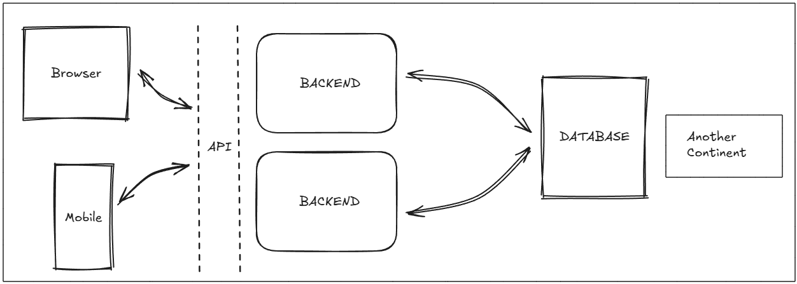

# Web Application Architecture

This document provides a foundational explanation of how modern web applications are structured. It breaks down the essential components and explains how they interact with each other, from the user's screen to the database.

---

## Backend Development Technologies

To build the backend, developers use a specific set of tools, often referred to as a "tech stack." Based on your notes, a common stack includes:

1.  **A Programming Language and Framework:**
    * **Language:** JavaScript (JS) is the language the code is written in. When used on a server, it runs in an environment called **Node.js**.
    * **Framework:** A framework like **Express.js** is often used with Node.js. It provides pre-built tools and a structure that makes it much faster and easier to build the API and backend logic.

2.  **A Database and Data Mapper:**
    * **Database:** This is where the data is stored. Examples include **MongoDB** (a NoSQL database that stores data in flexible, JSON-like documents) and **PostgreSQL** (a SQL database that stores data in structured tables).
    * **ORM / ODM:** Developers rarely write raw database queries. Instead, they use a tool called an **ORM** (Object-Relational Mapper) for SQL databases like PostgreSQL, or an **ODM** (Object-Document Mapper) for NoSQL databases like MongoDB. These tools let developers interact with the database using familiar JavaScript objects, which simplifies code and prevents common errors.
---

## The Core Components

A web application is typically divided into several distinct parts that work together. We can group them into the **Frontend** (what the user sees and interacts with) and the **Backend** (the machinery that works behind the scenes).

### 1. The Client (Frontend)

The client is any device a user utilizes to access the application. This is the "front door" to your service.

* **What it is:** A web browser (like Chrome or Firefox) or a mobile application (on a phone or tablet).
* **Primary Job:** To present the user interface (UI) to the user and capture their interactions (like clicks, form submissions, etc.). When a user performs an action, the client's job is to send a request for information or to change information.
* **Technology:** It's often built using languages like HTML, CSS, and JavaScript, along with frameworks like React, Angular, or Vue.js.

---

### 2. The API (Application Programming Interface)

The API acts as a well-defined messenger that allows the client and the backend to communicate without needing to know the complex inner workings of each other.

* **What it is:** A set of rules and protocols for building and interacting with software applications. It's the dashed line in the diagram, representing a communication gateway.
* **Primary Job:** To receive requests from the client, forward them to the backend for processing, and then return the backend's response to the client. For example, a client might send a request to an API endpoint like `/api/users/login` to log a user in.
* **Data Format:** Communication through an API is commonly done using a standard format like **JSON** (JavaScript Object Notation) because it is lightweight and easy for both humans and machines to read.

---

### 3. The Backend (Server-Side)

In simple terms, a **server** is a computer or device that "serves" a purpose, typically by providing data or functionality to other computers, known as clients.

The backend is the engine of the application. It's where all the critical logic, data processing, and decision-making happen. The user never interacts with the backend directly.

* **What it is:** One or more servers running your application code. The diagram shows two backend boxes to illustrate the concept of **scalability**—as more users access your application, you can add more backend servers to handle the increased load.
* **Primary Job:**
    * **Process Requests:** It takes the incoming requests from the API and executes the necessary logic. This could be anything from authenticating a user's password to calculating data for a report.
    * **Business Logic:** It enforces all the rules of your application (e.g., "a user cannot purchase an item that is out of stock").
    * **Database Communication:** It is the *only* part of the system that is allowed to communicate directly with the database to read, write, update, or delete data.

---

### 4. The Database

The database is the application's long-term memory. It is where all the data is stored permanently and securely.

* **What it is:** A structured system for storing, managing, and retrieving data. Examples include **PostgreSQL** or **MongoDB**.
* **Primary Job:** To store application data in an organized way. This includes user profiles, product information, posts, comments—everything that needs to be remembered between sessions. The backend queries the database to retrieve data for the client or to store new information.

---

### 5. Latency ("Another Continent")

The box labeled "Another Continent" is a visual reminder of a real-world constraint: **latency**.

* **What it is:** The delay that occurs when data travels over a network. The physical distance between servers and databases (or between the user and the servers) can impact how fast an application feels.
* **Why it Matters:** Developers must design applications to be efficient, minimizing the number of long-distance data requests to ensure the application is fast and responsive for users anywhere in the world.

---

## How It All Works Together: A Login Example

Let's trace a simple user login request to see how these components interact:

1.  **User Action (Client):** The user types their email and password into a login form in their browser and clicks "Login".
2.  **API Request:** The browser (client) sends the email and password in a structured request to the backend via the API. The request might go to the `/api/login` endpoint.
3.  **Backend Processing:** The backend server receives the request. It runs its authentication logic:
    * It first asks the **Database**: "Does a user exist with this email?"
    * The database finds the user record and sends it back to the backend.
    * The backend then securely compares the password provided by the user with the stored password hash from the database.
4.  **API Response:**
    * If the password is correct, the backend generates a success response (perhaps with an access token for future requests).
    * If the password is incorrect, it generates an error response (e.g., "Invalid credentials").
5.  **Update UI (Client):** The client receives the response from the API.
    * On success, it might redirect the user to their dashboard.
    * On failure, it might display an error message like "The email or password you entered is incorrect."

---
