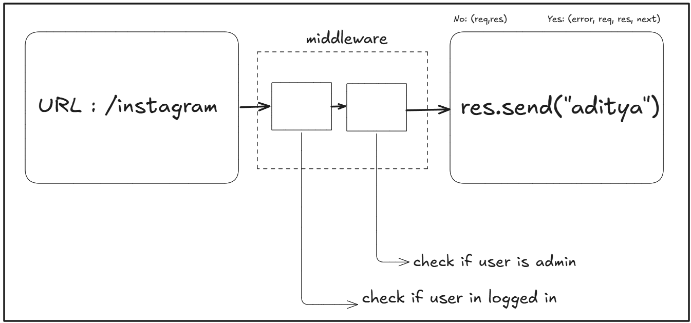

# Custom APIs with Node.js and Express

When building a web application, the backend (the server) needs a way to communicate with the frontend (the browser). This is done through an API (Application Programming Interface). Express.js is a popular framework for Node.js that makes it easier to build these APIs.

This guide will walk you through the essential concepts of creating a custom API, including handling requests, responses, errors, and using middleware.

---

## 1\. The Core: Request and Response

At the heart of any API are two fundamental objects: the **request** and the **response**.

-   **Request (`req`)**: This is an object that contains all the information about the incoming request from a client (like a web browser). This includes the URL they are trying to access, any data they sent, cookies, and more.
-   **Response (`res`)**: This is an object that you, the developer, use to send a response back to the client. You decide what to send back, whether it's a webpage, some data, or an error message.

Think of it like ordering food at a restaurant:

-   Your order is the **request** (`req`). You tell the waiter what you want.
-   The food you receive from the kitchen is the **response** (`res`).

### Handling Requests with `app.get` and `app.post`

You can define how your server should handle different types of requests. The two most common are:

-   **`app.get`**: Used for retrieving data from the server. For example, when you visit a website, your browser makes a GET request.
-   **`app.post`**: Used for sending data to the server to create something new. For example, when you submit a signup form.

<!-- end list -->

```javascript
// Example of a GET request
app.get("/profile", (req, res) => {
    // We send a JSON object as a response
    res.json({
        username: "Aditya",
        email: "aditya@example.com",
    });
});
```

---

## 2\. What is Middleware?

Middleware functions are like checkpoints or security guards that a request has to pass through before it reaches its final destination (the route handler that sends the response).

Each middleware function can:

1.  Execute any code.
2.  Make changes to the request (`req`) and response (`res`) objects.
3.  End the request-response cycle.
4.  Call the next middleware in the stack.

You can chain multiple middleware functions together. This is useful for tasks like checking if a user is logged in, validating data, or logging requests.

### Visualizing Middleware



The image is a perfect illustration of this concept.

1.  **Incoming Request**: A user tries to access the URL `/instagram`.
2.  **Middleware Checkpoints**: Before the server sends back the response, the request goes through middleware.
    -   **Checkpoint 1**: "check if user is logged in".
    -   **Checkpoint 2**: "check if user is admin".
3.  **Final Response**: If the request passes all the middleware checks, it finally reaches the code that sends the response: `res.send("Aditya")`. If it fails a check, a middleware could send an error response instead.

Middleware functions typically accept three arguments: `req`, `res`, and `next`. The `next` function is called to pass control to the next middleware. Error-handling middleware has a fourth argument: `error`.

---

## 3\. Setting Up Your Express Application

Let's break down the setup file (`app.js`). This file configures your Express application by setting up several important middleware.

First, you need to install the necessary packages using npm (Node Package Manager):

```bash
npm install express cors cookie-parser
```

Here is the complete code for your `app.js` file:

```javascript
import express from "express";
import cors from "cors";
import cookieParser from "cookie-parser";

const app = express();

// Middleware is almost always added with app.use()
app.use(
    cors({
        origin: process.env.CORS_ORIGIN,
        credentials: true,
    })
);

app.use(express.json({ limit: "16kb" }));
app.use(express.urlencoded({ extended: true, limit: "16kb" }));
app.use(express.static("public"));
app.use(cookieParser());

export { app };
```

---

## 4\. Explanation of Configuration Lines

Let's look at what each `app.use()` line does. These are all examples of adding middleware to your application.

### `app.use(cors({...}))`

-   **What is it?** `cors` stands for Cross-Origin Resource Sharing. By default, for security reasons, a web browser will block a frontend application from making API requests to a backend that is on a different domain (or "origin"). This middleware unlocks that restriction.
-   **`origin: process.env.CORS_ORIGIN`**: This tells the server which frontend URLs are allowed to make requests. For example, if your frontend is `http://localhost:3000`, you would set `CORS_ORIGIN` to that value.
-   **`credentials: true`**: This allows the frontend to include cookies in its requests to the backend.

### `app.use(express.json({limit: "16kb"}))`

-   **What is it?** This is a built-in Express middleware that parses incoming requests with JSON payloads. When a client sends data to your API in JSON format (which is very common), this middleware understands it and makes it available in `req.body`.
-   **Example**: If a client sends `{"name": "John"}`, you can access it in your route handler as `req.body.name`.
-   **`limit: "16kb"`**: This sets a maximum size for the JSON data to prevent users from sending overly large files that could crash your server.

### `app.use(express.urlencoded({extended: true, limit: "16kb"}))`

-   **What is it?** This middleware is similar to `express.json()`, but it parses data that comes from an HTML form submission (the kind with `Content-Type: application/x-www-form-urlencoded`). It also makes the data available in `req.body`.
-   **`extended: true`**: This option allows for parsing complex objects and arrays from the URL-encoded data. It's generally recommended to keep it as `true`.
-   **`limit: "16kb"`**: Just like with JSON, this limits the size of the incoming form data.

### `app.use(express.static("public"))`

-   **What is it?** This middleware serves static files, such as images, CSS files, and JavaScript files.
-   **Example**: If you have a folder named `public` in your project with an image `logo.png` inside it, users can access it directly from their browser by going to `http://yourdomain.com/logo.png`. Express will automatically look in the `public` folder.

### `app.use(cookieParser())`

-   **What is it?** This middleware parses the `Cookie` header from incoming requests and makes the cookies available in `req.cookies`. It also allows you to set cookies on the response using `res.cookie()`.
-   **Example**: You can read a cookie named `session_id` with `req.cookies.session_id` and set a new cookie with `res.cookie("username", "Aditya")`.

---

## 5\. Handling Data: `req.body` and `req.params`

-   **`req.body`**: This property contains the data sent in the body of a POST request. It is empty by default and gets populated by middleware like `express.json()` or `express.urlencoded()`.
-   **`req.params`**: This property contains route parameters. These are named segments of the URL.
    -   **Example**: If your route is defined as `/users/:userId`, and a user visits `/users/123`, then `req.params` will be `{ "userId": "123" }`. This is useful for fetching specific items from a database.

<!-- end list -->

```javascript
// Example using req.params
app.get("/users/:userId", (req, res) => {
    const id = req.params.userId;
    res.send(`Fetching profile for user with ID: ${id}`);
});
```

---

## 6\. Concepts Explainations

### Core Concept: Middleware

-   **Middleware**: Think of middleware as a series of checkpoints or "helpers" that an incoming request must pass through before your main code handles it. Each helper can inspect the request, modify it, or even block it if something is wrong. Common tasks for middleware include checking if a user is logged in, logging request details, or preparing incoming data.
-   **`app.use()`**: This is the primary command you use in Express to tell your application, "I want to use this helper (middleware) for all or most incoming requests." It's like setting up a permanent security checkpoint at the entrance of your application. As your note says, `app.use()` is the most common way to apply middleware.

### Parsers: The Translators

A **Parser** is a special type of middleware whose only job is to translate incoming data from a raw format (like text) into a structured format that your JavaScript code can easily use (like an object).

-   **Body-Parser**: This is a parser that specifically looks at the main "body" of an incoming request. When a user submits a form or a frontend sends JSON data, that data is in the request body. The body-parser middleware reads this raw data and converts it into a usable JavaScript object. `express.json()` and `express.urlencoded()` are both body-parsers.
-   **Cookie-Parser**: This is a parser that specifically looks for cookies sent from the browser. It reads the raw cookie string and translates it into a neat JavaScript object, making it easy for you to see what cookies the user has.

### Handling Incoming Data

Once the parsers have done their job, the translated data is made available on the request (`req`) object in different properties.

-   **`request.body` (`req.body`)**: This is where the **Body-Parser** places its translated data. If a user signs up and sends `{"username": "Aditya", "password": "123"}`, the body-parser will process it, and you can access the username with `req.body.username`. **This property will be empty if you don't use a body-parser.**
-   **`request.params` (`req.params`)**: This property contains data that is part of the URL path itself. It's used to identify a specific resource. For example, in a URL like `/users/123`, the `123` is a parameter. Express lets you access it with `req.params.userId` (if your route is defined as `/users/:userId`).

### Specific Middleware & Concepts

-   **CORS (Cross-Origin Resource Sharing)**: `cors` is a middleware that solves a common security issue. By default, browsers block a web page from making API requests to a server on a different domain. For example, if your website is `my-cool-app.com` and your API is `api.my-cool-app.com`, the browser will block communication. The `cors` middleware tells the browser, "It's okay, I trust requests coming from this specific domain."
-   **Cookies**: Cookies are small pieces of information that a server tells a browser to store. The browser then sends the cookie back with every future request to that server. They are most commonly used to remember if a user is logged in. Think of it like a coat check ticket: you give your coat, get a ticket, and the server recognizes you by that ticket every time you show it. The **Cookie-Parser** is what allows the server to read the ticket.

---
