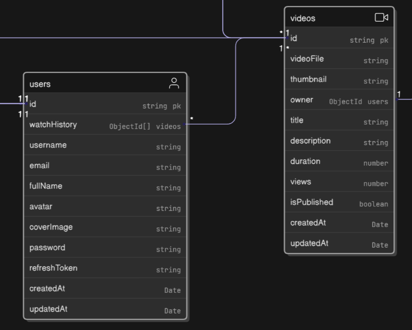

# Data Modeling - User and Video using Hooks and JWT (Json Web Tokens)

When building a complex application like a video-sharing platform, the foundation is the **data model**. This is the blueprint that defines what kind of information you need to store and how different pieces of information relate to each other. This guide will walk you through creating the core data models for users and videos using Mongoose (a tool for working with MongoDB), and then explore how to add essential security features and handle complex data queries.

-----

## **Part 1: The User Model - The Blueprint for Your Users**

The first step is to define what a "user" looks like in our application. We create a `userSchema` to act as a blueprint for every user document in our database.



### **User Schema Code**

```javascript
import mongoose, { Schema } from "mongoose";

const userSchema = new mongoose.Schema(
    {
        username: {
            type: String,
            required: true,
            unique: true,
            lowercase: true,
            trim: true, // Removes whitespace from both ends of a string
            index: true, // Creates a database index for faster searching
        },
        email: {
            type: String,
            required: true,
            unique: true,
            lowercase: true,
            trim: true,
        },
        fullName: {
            type: String,
            required: true,
            trim: true,
            index: true,
        },
        avatar: {
            type: String, // URL to the image
            required: true,
        },
        coverImage: {
            type: String, // URL to the image
        },
        watchHistory: [
            {
                type: Schema.Types.ObjectId,
                ref: "Video", // Reference to the Video model
            },
        ],
        password: {
            type: String,
            required: [true, "Password is required"],
        },
        refreshToken: {
            type: String,
        },
    },
    { timestamps: true } // Automatically adds createdAt and updatedAt fields
);
```

### **Breaking Down the User Schema Fields**

  * **`username`**, **`email`**, **`fullName`**: These are basic string fields with important validation rules:
      * **`required: true`**: A user cannot be created without this field.
      * **`unique: true`**: No two users can have the same username or email. The database will enforce this.
      * **`lowercase: true`**: Automatically converts the input to lowercase to prevent duplicates like "Aditya" and "aditya".
      * **`trim: true`**: Automatically removes any accidental spaces at the beginning or end of the input (e.g., `" aditya "` becomes `"aditya"`).
      * **`index: true`**: This is a performance optimization. Think of it like an index at the back of a book. It makes searching for users by their username or full name much faster.
  * **`avatar`** and **`coverImage`**: These fields will store a URL pointing to the user's images. We don't store the images directly in the database; instead, we upload them to a service like Cloudinary and save the link here.
  * **`watchHistory`**: This is a key feature.
      * It is an **array** (`[]`), meaning a user can have a history of many videos.
      * The `type` is `Schema.Types.ObjectId`. This is a special data type that MongoDB uses for unique IDs.
      * **`ref: "Video"`**: This is the most important part. It creates a **reference** or a link between this field and the `Video` model. It tells Mongoose, "The ID stored here belongs to a document in the 'Video' collection."
  * **`password`**: Stores the user's password. We will add a layer of security to this later so it's never stored in plain text. The `required` field includes a custom error message.
  * **`refreshToken`**: This field is used for authentication, specifically to keep a user logged in for an extended period. We'll cover this with JSON Web Tokens (JWT).
  * **`{ timestamps: true }`**: This is a Mongoose option that automatically adds two fields to every user document: `createdAt` and `updatedAt`, which are managed for you.

-----

## **Part 2: The Video Model - The Blueprint for Videos**

Similarly, we need a schema to define the structure of a video document.

### **Video Schema Code**

```javascript
import mongoose, { Schema } from "mongoose";

const videoSchema = new mongoose.Schema(
    {
        videoFile: {
            type: String, // URL from a cloud service like Cloudinary
            required: true,
        },
        thumbnail: {
            type: String, // URL from a cloud service
            required: true,
        },
        owner: {
            type: Schema.Types.ObjectId,
            ref: "User", // A reference to the user who uploaded the video
        },
        title: {
            type: String,
            required: true,
        },
        description: {
            type: String,
        },
        duration: {
            type: Number, // Video duration in seconds
        },
        views: { // Note: 'view' was in the notes, 'views' is more conventional
            type: Number,
            default: 0, // Videos start with 0 views
        },
        isPublished: {
            type: Boolean,
            default: true, // Default to published
        },
    },
    { timestamps: true }
);
```

### **Breaking Down the Video Schema Fields**

  * **`videoFile`** and **`thumbnail`**: Like the avatar, these fields store URLs from a cloud service where the actual video and image files are hosted. Storing large files in the database is inefficient.
  * **`owner`**: This is another crucial reference. It links a video back to the user who uploaded it. The `ref: "User"` tells Mongoose that the ID stored here belongs to a document in the 'User' collection.
  * **`title`** and **`description`**: Basic text fields for video details.
  * **`duration`**: A number to store the length of the video, typically in seconds.
  * **`views`**: A number that tracks how many times the video has been watched. It has a `default: 0`, so every new video starts with zero views.
  * **`isPublished`**: A boolean (`true` or `false`) to control the video's visibility. This allows for features like private videos or drafts.

-----

## **Part 3: Security - Hashing Passwords with Hooks and Managing Sessions with JWT**

Storing plain-text passwords is a major security risk. Mongoose **hooks** (also called middleware) allow us to run code automatically before certain events, like saving a document.

  * **Password Hashing with a "Pre" Hook**: We can set up a `pre('save', ...)` hook on the `userSchema`. This function will run just before a user document is saved. Inside it, we will use a library like **bcrypt** to hash the password, ensuring we only store a secure, scrambled version.

  * **Managing Authentication with JWT**: **JWT (JSON Web Tokens)** are used to verify a user's identity without them having to send their password with every request.

      * When a user logs in, the server generates an **Access Token** and a **Refresh Token**.
      * The **Access Token** is a short-lived token sent with every request to prove identity.
      * The **Refresh Token** (which we have in our schema) is a long-lived token used only to get a new access token when the old one expires.

-----

## **Part 4: Handling Complexity with Aggregation Pipelines**

A feature like `watchHistory` can become very complex to query. For example, "Find all users who watched a specific video and also recommend other videos they might like." Simple database queries can't handle this.

This is where **Aggregation Pipelines** come in.

**Analogy**: Think of an aggregation pipeline as a factory assembly line for your data. You send your raw data in one end, and it passes through a series of stations (stages). Each station performs a specific operation: filtering, sorting, grouping, reshaping, etc. What comes out the other end is precisely the data you need, in the format you want.

### **Simplifying Aggregation with a Plugin**

Writing aggregation pipelines can be complicated, especially when you need to add **pagination** (e.g., showing results 1-10 on page 1, 11-20 on page 2, etc.).

Your notes correctly identify the solution: the **`mongoose-aggregate-paginate-v2`** plugin. This package simplifies the process by adding a `.aggregatePaginate()` method to your Mongoose models.

### **How to Use the Plugin**

As shown in your notes, you just need to add the plugin to your schema.

```javascript
// 1. Import the plugin
import aggregatePaginate from "mongoose-aggregate-paginate-v2";

// 2. Define your schema as usual
const videoSchema = new mongoose.Schema({
    /* ... your schema definition ... */
});

// 3. Attach the plugin to the schema
videoSchema.plugin(aggregatePaginate);

// 4. Create your model
export const Video = mongoose.model("Video", videoSchema);
```

Now, you can run complex aggregation queries on the `Video` model and get paginated results easily, which is perfect for features like infinite scrolling or navigating through a user's watch history.
