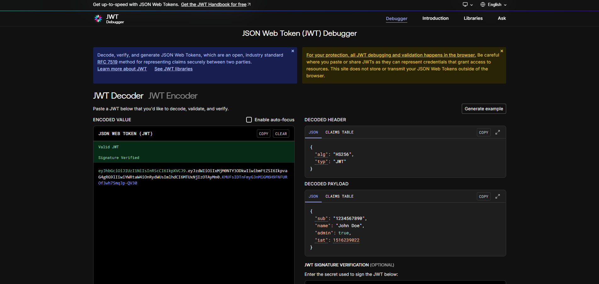

## **Encryption and JWT Tokens**

Now that we have our basic data models for users and videos, it's time to add two critical features for any real-world application: **password security** and **user authentication**. We'll accomplish this by integrating two powerful libraries (`bcrypt` and `jsonwebtoken`) directly into our `userSchema` using Mongoose's advanced features like middleware and custom methods.

-----

## **1. Choosing Your Tools: Securing Passwords and Creating Tokens**

First, let's install the necessary packages.

```bash
npm install bcrypt jsonwebtoken
```

### **`bcrypt` vs. `bcryptjs`**

You might see two versions of the bcrypt library. Here’s the difference:

  * **`bcrypt` (What we're using)**: This is a native addon, meaning parts of it are written in a lower-level language like C++. This makes it **significantly faster** and better for performance-critical applications. It can sometimes have more complex installation steps depending on your system's setup.
  * **`bcryptjs`**: This is a version written entirely in JavaScript. It is slightly slower but has no native dependencies, making it easier and more universally compatible to install.

**Verdict**: For production applications where performance matters, **`bcrypt` is the recommended choice**.

### **JSON Web Tokens (`jsonwebtoken`)**

**JWT** is the industry standard for creating access tokens. A token is a secure piece of information that the server sends to a user after they log in. The user then sends this token back with every future request to prove they are who they say they are.


A JWT looks like a long string of random characters, but it's actually made of three parts separated by dots:

1.  **Header**: Contains metadata, like the algorithm used to sign the token.
2.  **Payload**: Contains the actual data, or "claims," about the user (e.g., their ID, email, name). **This data is readable by anyone**, so never store sensitive information like passwords in the payload.
3.  **Signature**: A cryptographic signature created using the header, payload, and a secret key known only to your server. This signature guarantees that the token hasn't been tampered with.

-----

## **2. Hashing Passwords Automatically with Mongoose Middleware**

We must **never** store passwords in plain text. Mongoose **middleware** (or **hooks**) are functions that automatically run before or after certain events, like saving a document. We'll use a `pre('save')` hook to ensure passwords are encrypted *before* they are ever saved to the database.

### **The Code: A "Pre-Save" Hook**

```javascript
// This code is added to your user.model.js file

userSchema.pre("save", async function (next) {
    // Only run this function if the password was actually modified
    if (!this.isModified("password")) return next();

    // Hash the password with a cost factor of 10
    this.password = await bcrypt.hash(this.password, 10);
    next();
});
```

### **How It Works, Step-by-Step**

1.  `userSchema.pre("save", ...)`: This tells Mongoose, "Before you execute a `save` command on any user document, run this function first."
2.  `async function (next)`: The function is asynchronous because hashing is a time-consuming process. The `next` parameter is a function we call to pass control to the next piece of middleware, or to the final `save` operation. It’s like saying, "My part is done, you can proceed."
3.  `if (!this.isModified("password")) return next();`: This is a crucial optimization. The `this` keyword refers to the current user document. This line checks if the password field has been changed. If not (e.g., the user is just updating their avatar), we skip the hashing process entirely and call `next()` to move on. This prevents re-hashing an already hashed password.
4.  `this.password = await bcrypt.hash(this.password, 10)`: This is where the magic happens.
      * `bcrypt.hash()` takes the plain-text password (`this.password`).
      * The `10` is the number of "salt rounds." It determines how computationally intensive (and thus, how secure) the hashing process is. 10 is a good, standard value.
      * The result—a long, scrambled string—overwrites the plain-text password on the user document.
5.  `next()`: We call this to signal that our hook has finished and the save operation can continue.

-----

## **3. Creating Custom Methods for Authentication**

Mongoose allows you to add your own reusable functions directly onto your schema. These are called **methods**. We'll create methods for checking a password and for generating the JWTs.

### **Method 1: Checking the Password**

```javascript
// This method will be available on every user document
userSchema.methods.isPasswordCorrect = async function (password) {
    // `bcrypt.compare` securely compares the plain-text password with the stored hash
    return await bcrypt.compare(password, this.password);
};
```

When a user tries to log in, they provide their password. We can't hash their input and compare it to the database hash directly. Instead, `bcrypt.compare()` handles this for us securely. It will return `true` if the passwords match and `false` otherwise.

### **Methods 2 & 3: Generating Tokens**

```javascript
// Method to generate a short-lived access token
userSchema.methods.generateAccessToken = function () {
    return jwt.sign(
        {
            // Payload: Data to store in the token
            _id: this._id,
            email: this.email,
            username: this.username,
            fullName: this.fullName,
        },
        process.env.ACCESS_TOKEN_SECRET,
        {
            expiresIn: process.env.ACCESS_TOKEN_EXPIRY,
        }
    );
};

// Method to generate a long-lived refresh token
userSchema.methods.generateRefreshToken = function () {
    return jwt.sign(
        {
            // The refresh token needs less information
            _id: this._id,
        },
        process.env.REFRESH_TOKEN_SECRET,
        {
            expiresIn: process.env.REFRESH_TOKEN_EXPIRY,
        }
    );
};
```

These methods use `jwt.sign()` to create the tokens. This function takes three arguments:

1.  **The Payload**: A JavaScript object containing the data you want to embed in the token.
2.  **The Secret Key**: A secret string read from your environment variables. This is used for the signature and must be kept safe.
3.  **The Options**: An object where you can set properties like `expiresIn`.

-----

## **4. Environment Variables for Security**

Your token secrets and expiry times should never be hard-coded. They belong in a `.env` file.

**`.env` File**

```
ACCESS_TOKEN_SECRET=your-super-secret-and-long-access-string
ACCESS_TOKEN_EXPIRY=1d

REFRESH_TOKEN_SECRET=your-even-more-secret-and-longer-refresh-string
REFRESH_TOKEN_EXPIRY=10d
```

  * **Access Token**: Short expiry (e.g., 1 day). Used for most API requests. It is **not** stored in the database.
  * **Refresh Token**: Long expiry (e.g., 10 days). Its only job is to request a new access token. It **is** stored in the user's database document so we can manage and revoke sessions.

  **Important Note on Secrets**: Your secret keys should be long, random, and impossible to guess. You can quickly generate a strong secret key by running the following command in your terminal:

```bash
node -e "console.log(require('crypto').randomBytes(64).toString('hex'))"
```

You can also use online tools like the debugger at [jwt.io](https://www.jwt.io/) to inspect the contents of your tokens during development.



-----

## **5. Finalizing the Models**

With these security features added to the `userSchema`, your complete models are now much more robust and ready for a real-world application.

**Final `user.model.js` (Summary)**

```javascript
// ... imports ...

const userSchema = new mongoose.Schema({ /* ... fields ... */ }, { timestamps: true });

// Hook for password hashing
userSchema.pre("save", /* ... async function ... */);

// Custom methods
userSchema.methods.isPasswordCorrect = /* ... async function ... */;
userSchema.methods.generateAccessToken = /* ... function ... */;
userSchema.methods.generateRefreshToken = /* ... function ... */;

export const User = mongoose.model("User", userSchema);
```

**Final `video.model.js` (Summary)**

```javascript
// ... imports ...
import mongooseAggregatePaginate from "mongoose-aggregate-paginate-v2";

const videoSchema = new mongoose.Schema({ /* ... fields ... */ }, { timestamps: true });

// Add the plugin for complex, paginated queries
videoSchema.plugin(mongooseAggregatePaginate);

export const Video = mongoose.model("Video", videoSchema); // Corrected model name
```

----
