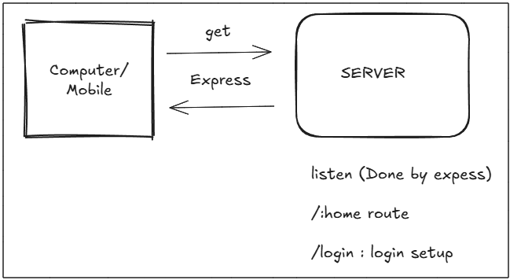

# Basic Node.js Backend Setup

## Core Concepts



A backend is the server-side of an application that handles the core logic. Its primary responsibilities include managing **data**, serving **files**, and interacting with third-party **APIs**.

  * **Node.js:** A JavaScript runtime environment that allows us to run JavaScript code on a server, outside of a web browser.
  * **Client-Server Model:** As shown in the diagram, a **Client** (like a computer or mobile device) makes requests to a **Server**. The server processes these requests and sends back a response. Frameworks like **Express.js** are used to manage this communication, handling different **routes** (e.g., `/home`, `/login`) and "listening" for incoming requests.

-----

## Professional Project Structure

A well-organized file structure is crucial for maintaining and scaling a project. Below is a standard structure for a Node.js application.

```
.
├── src/
│   ├── app.js          # Main application configuration (middleware, cookies, etc.)
│   ├── index.js        # Entry point of the application, connects to the database
│   ├── constants.js    # Stores constant values like database names, enums
│   ├── controllers/    # Contains the business logic and functionality for routes
│   ├── db/             # Database connection logic
│   ├── middlewares/    # Custom functions that run between request and response
│   ├── models/         # Defines the schema for your data (e.g., User, Post)
│   ├── routes/         # Defines the API endpoints (e.g., /users, /products)
│   └── utils/          # Reusable utility functions (e.g., ApiResponse, file upload)
│
├── .env                # Stores environment variables (database URLs, API keys)
├── .gitignore          # Specifies files and folders for Git to ignore
├── package.json        # Contains project metadata and lists dependencies
└── README.md           # Project documentation
```

-----

## Step-by-Step Setup Guide

Follow these instructions to create your Node.js project from scratch.

### Prerequisites

First, ensure you have **Node.js** and **npm** (Node Package Manager) installed on your system. You can check by running the following commands in your terminal:

```bash
node -v
npm -v
```

### 1\. Initialize Your Project

1.  Open your terminal and create a new directory for your project.
2.  Navigate into the new directory.
3.  Run the `npm init` command. This command will prompt you for some information about your project and generate a `package.json` file. You can press Enter to accept the default values for most prompts.

<!-- end list -->

```bash
npm init
```

After completing the prompts, a `package.json` file will be created in your directory. It will look similar to this:

```json
{
  "name": "my-project",
  "version": "1.0.0",
  "description": "A basic app to deploy",
  "main": "index.js",
  "scripts": {
    "test": "echo \"Error: no test specified\" && exit 1"
  },
  "keywords": [],
  "author": "Your Name",
  "license": "ISC"
}
```

### 2\. Create the Entry File

Create a file named `index.js` (or whatever you set as your `main` entry point in `package.json`). Inside this file, add a simple line of code to test that everything works.

```javascript
// index.js
console.log("Hello World");
```

### 3\. Run the Application Directly

You can now execute your script directly from the terminal using Node.

```bash
node index.js
```

You should see "Hello World" printed to the console.

### 4\. Use npm Scripts for Convenience

Running commands directly is fine, but it's better practice to use npm scripts. This allows you and other developers to run the project with a consistent, simple command.

1.  Open your `package.json` file.
2.  Modify the `scripts` section to add a `start` command.

<!-- end list -->

```json
{
  "name": "my-project",
  "version": "1.0.0",
  "description": "A basic app to deploy",
  "main": "index.js",
  "scripts": {
    "start": "node index.js"
  },
  "keywords": [],
  "author": "Your Name",
  "license": "ISC"
}
```

Now, you can run your application with the following command:

```bash
npm start
```

This command tells npm to look in your `package.json` file for the `start` script and execute the command associated with it (`node index.js`). You will see the same "Hello World" output in your terminal.

  ---
