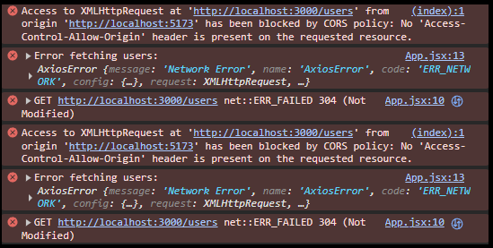

# Connecting a React Frontend to an Express Backend

This comprehensive guide walks you through the entire process of connecting a frontend application built with **React** to a backend server running **Express.js**.

---

## Part 1: Setting Up the React Frontend

First, we'll create the user interface of our application using **React** and the modern build tool, **Vite**.

### What is Vite?

Think of **Vite** as a high-speed construction manager for your website. You write code in React's special JSX syntax, and Vite instantly bundles it into standard HTML, CSS, and JavaScript that any browser can understand. Its incredible speed makes the development process smooth and enjoyable.

1.  **Create the Project**: Navigate to your `frontend` folder in the terminal and run:

    ```bash
    npm create vite@latest .
    ```

    -   `npm create`: Initializes a new project from a template.
    -   `vite@latest`: Specifies the latest Vite template.
    -   `.`: Creates the project in the current directory.

2.  **Follow the Prompts**: When prompted, select **React** as your framework and **JavaScript** as your variant.

3.  **Install Dependencies**: Vite creates a `package.json` file that lists the project's required libraries. Run the following to download them into a `node_modules` folder:

    ```bash
    npm install
    ```

4.  **Install Axios**: To communicate with our backend, we'll use **Axios**, a powerful library for making network requests.

    ```bash
    npm install axios
    ```

### Why Use Axios Over Native Fetch?

While modern browsers have a built-in `fetch()` function for making network requests, developers often prefer Axios for several key reasons that make it more powerful and convenient, especially in larger applications.

| Feature                  | Native `fetch()`                                                                                                                                                  | `axios`                                                                                                                                                         | Why It Matters                                                                                                                                                       |
| :----------------------- | :---------------------------------------------------------------------------------------------------------------------------------------------------------------- | :-------------------------------------------------------------------------------------------------------------------------------------------------------------- | :------------------------------------------------------------------------------------------------------------------------------------------------------------------- |
| **Data Handling**        | Requires a two-step process: first make the request, then manually parse the response (e.g., `response.json()`).                                                  | Automatically transforms response data into a JavaScript object (`response.data`).                                                                              | Axios reduces boilerplate code, making your data-fetching logic cleaner and more readable.                                                                           |
| **Error Handling**       | Does not consider HTTP error statuses (like `404` or `500`) as errors. It only fails on network errors. You must manually check `response.ok` and throw an error. | Automatically rejects the promise for all HTTP error statuses (4xx and 5xx), triggering the `.catch()` block.                                                   | This makes error handling more intuitive and robust. You can handle all types of failures in one place (`.catch()`), from network issues to server-side problems.    |
| **Request Cancellation** | Can be done using an `AbortController`, but the setup is manual and verbose.                                                                                      | Provides a simple, built-in cancellation mechanism to abort requests.                                                                                           | This is crucial for preventing unnecessary network activity, like when a user navigates away from a page before a request completes.                                 |
| **Interceptors**         | No built-in support. You must write wrapper functions to achieve similar functionality.                                                                           | Allows you to set up **interceptors**—functions that can globally inspect or modify all requests before they are sent or all responses before they are handled. | Interceptors are incredibly powerful for tasks like automatically attaching authentication tokens to every request or creating centralized loading state indicators. |
| **Browser Support**      | Modern, but may require a polyfill for very old browsers.                                                                                                         | Has wider, built-in support for older browsers and provides consistent functionality across different environments.                                             | Provides peace of mind and reduces compatibility issues.                                                                                                             |

For these reasons, **Axios is often preferred** for its developer-friendly features that simplify complex scenarios like error handling, data transformation, and request management.

---

## Part 2: Building the React Component

In React, the UI is built with **components**—reusable, self-contained blocks of code. Our main component is `App.jsx`. Replace the contents of `src/App.jsx` with the code below.

```javascript
import React, { useState, useEffect } from "react";
import axios from "axios";

const App = () => {
    // STATE: The component's memory for data that changes.
    const [users, setUsers] = useState([]);

    // EFFECT: Runs side effects, like fetching data, after the component renders.
    useEffect(() => {
        axios
            .get("/api/v1/users")
            .then((response) => {
                // On success, update the state with the fetched data.
                setUsers(response.data);
            })
            .catch((error) => {
                // On failure, log the error.
                console.error("Error fetching users:", error);
            });
    }, []); // An empty array ensures this effect runs only ONCE.

    // RENDER: The JSX that defines the component's UI.
    return (
        <>
            <h1>Users</h1>
            <p>Total No. of Users: {users.length}</p>

            {/* Map over the users array to render a list of users. */}
            {users.map((user) => (
                <div key={user.id}>
                    <h3>{user.name}</h3>
                    <p>{user.email}</p>
                </div>
            ))}
        </>
    );
};

export default App;
```

### State: The Component's Memory

The line `const [users, setUsers] = useState([]);` uses a React **Hook** to declare a **state** variable.

-   **State** is any data in your component that can change over time and should cause the UI to update.
-   `useState([])` initializes our state with an empty array because we're expecting a list of users.
-   `users`: The variable that holds the current state data (read-only).
-   `setUsers`: The function used to update the state. Calling this function tells React to re-render the component.

### Effect: Handling Side Effects

The `useEffect(() => { ... }, []);` Hook manages **side effects**—operations that interact with the outside world, like API calls.

-   The function inside `useEffect` contains the logic for the side effect (our `axios` call).
-   The empty dependency array `[]` is critical: it ensures the effect runs **only once** when the component first mounts, preventing an infinite loop of data fetching.

### Rendering: The JSX UI

The `return(...)` statement contains **JSX**, a syntax that lets you write HTML-like code in JavaScript.

-   `{users.length}`: Curly braces `{}` embed JavaScript expressions directly in JSX.
-   `users.map(...)`: We use the standard JavaScript `.map()` function to iterate over our `users` array and convert each user object into a `<div>` element, which is the standard React pattern for rendering lists.
-   `key={user.id}`: The `key` prop is essential for lists. It must be a unique, stable identifier that helps React efficiently update the UI when the list changes.

---

## Part 3: The CORS Error: The Inevitable Security Hurdle

When you run your frontend and backend


Why is the Total No. of Users 0.
Now Check for the errors in the browser console.



These errors are because they are on different "origins" (`localhost:5173` vs. `localhost:3000`).

### What is CORS? (An Analogy)

**CORS** (Cross-Origin Resource Sharing) is a browser security feature designed to protect both users and servers.

Imagine your frontend application is your **home**. You only want to allow trusted people, like family and friends, to enter. You certainly don't want strangers or salespeople walking in uninvited. In this analogy, CORS is your home's security system.

An **"origin"** is defined by the combination of **protocol** (`http`), **domain** (`localhost`), and **port** (`5173`). If any of these differ, it's a "cross-origin" request.

-   **Frontend Origin**: `http://localhost:5173`
-   **Backend Origin**: `http://localhost:3000`

Because the **ports are different**, the browser blocks the request by default. This is a crucial security measure. Without it, any malicious website could make requests to your backend, potentially stealing data or running up massive server bills from billions of unwanted requests. To allow a cross-origin request, the **backend server must explicitly grant permission** by "whitelisting" the frontend's origin.

---

## Part 4: Solving CORS with a Proxy (The Developer's Best Friend)

While the backend can be configured to handle CORS for production, the best way to handle it during development is to configure a **proxy** in Vite. A proxy acts as a middleman, forwarding requests from the frontend to the backend, which tricks the browser into thinking both are on the same origin.

### Step 1: Standardize Your API Routes (Best Practice)

Writing the full URL like `http://localhost:3000/users` in your frontend code is a bad practice. It's inflexible and will break when you deploy your application to a live server. The professional standard is to use relative paths and prefix your API routes.

-   **In your backend `server.js`**, update your route to be more descriptive and versioned:
    ```javascript
    // Change this route and restart your backend server:
    app.get("/api/v1/users", (req, res) => {
        /* ... */
    });
    ```
    -   `/api`: Marks it as an API endpoint.
    -   `/v1`: Stands for "version 1," allowing you to introduce future versions (`/v2`) without breaking older applications.

### Step 2: Update the Frontend Call (and see the new error)

Now, let's update the frontend to use this standardized, relative URL.

-   **In your frontend `App.jsx`**, change the `axios` call:
    ```javascript
    // This is the goal, but it won't work yet!
    axios.get("/api/v1/users");
    ```
    If you restart your frontend server now, the CORS error will disappear, but you will get a new **404 Not Found** error in the console. This happens because the browser sends the request to `http://localhost:5173/api/v1/users` (your frontend server), which doesn't have this route defined. The request never reaches your backend server.

### Step 3: Configure the Vite Proxy (The Solution)

This is where the proxy comes in. We will tell our frontend development server (Vite) to "proxy" or forward any request that starts with `/api` to our backend server.

-   **In your frontend's `vite.config.js` file**, add the `server` configuration:

    ```javascript
    import { defineConfig } from "vite";
    import react from "@vitejs/plugin-react";

    export default defineConfig({
        server: {
            proxy: {
                // This rule forwards any request starting with "/api"
                // to your backend server at http://localhost:3000.
                "/api": "http://localhost:3000",
            },
        },
        plugins: [react()],
    });
    ```

---

### How Does the Proxy Work?

By adding this configuration, you are creating a powerful rule for the Vite development server.

Now, whenever your React code makes a request to a path starting with `/api` (like `/api/v1/users`), Vite intercepts it **before** it goes to the browser. Instead of trying to handle it itself, Vite forwards the request to `http://localhost:3000`.

Crucially, it's more than just appending the URL. The proxy makes the request on your behalf, so from the backend's perspective, the request appears to be coming from the **same origin** (`localhost:3000`). This completely bypasses the browser's CORS security restrictions, solving the problem cleanly for development.

---

## Part 5: The Final Result

With both servers restarted, your application will now work perfectly. The frontend fetches data from the backend, and the list of users is displayed on the screen.


---

### A Note on Production vs. Development

The proxy setup is **only for development**. When you build your app for production (`npm run build`), the proxy does not work.

A common but often inflexible method for production is to:

1.  Run `npm run build` in the frontend.
2.  Copy the resulting `dist` folder into the backend.
3.  Use `app.use(express.static('dist'))` in `server.js` to serve the frontend files from the backend.

While this saves you from needing two separate servers, it's a **bad practice for modern applications**. It forces you to rebuild and redeploy your entire backend every time you make a small frontend change. **Keeping your frontend and backend separate** allows you to deploy and scale them independently, which is far more efficient.

---
